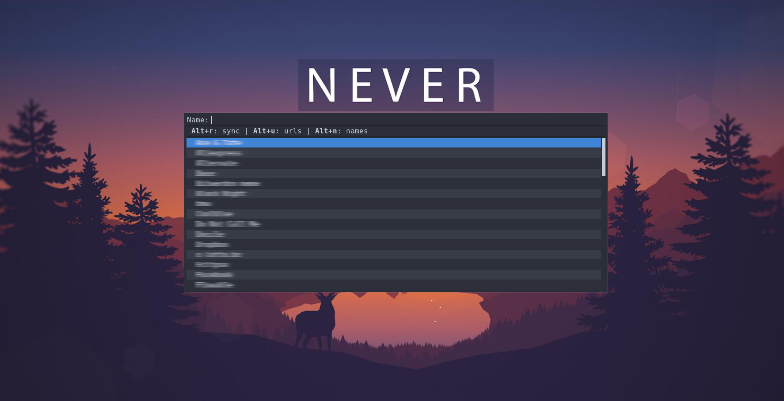

# Bitwarden Rofi Menu

This is a work in progress to get the BitWarden cli functionality in an easy Rofi menu.
On selecting an entry, the password is copied to your clipboard for 5 seconds.
During those 5 seconds, a notification is shown indicating which password you
are copying at that time.



## Usage

You can either execute the script from a terminal or by binding it to a key
combination in your window manager.

```
bwmenu 0.4

Usage:
  bwmenu [options] -- [rofi options]

Options:
  --help
      Show this help text and exit.

  --version
      Show version information and exit.

  --auto-lock <SECONDS>
      Automatically lock the Vault <SECONDS> seconds after last unlock.
      Use 0 to lock immediatly.
      Use -1 to disable.
      Default: 900 (15 minutes)

  -c <SECONDS>, --clear <SECONDS>, --clear=<SECONDS>
      Clear password from clipboard after this many seconds.
      Defaults: 5 seconds.

  -C, --no-clear
      Don't automatically clear the password from the clipboard. This disables
      the default --clear option.

  --show-password
      Show the first 4 characters of the copied password in the notification.

Quick Actions:
  When hovering over an item in the rofi menu, you can make use of Quick Actions.

  Alt+r  Resync your vault

  Alt+u  Search through urls
  Alt+n  Search through names
  Alt+c  Search through folders

  Alt+t  Copy the TOTP
  Alt+1  Autotype the username and password [needs xdotool (Xorg) / ydotool (Wayland)]
  Alt+2  Autotype the username [needs xdotool (Xorg) / ydotool (Wayland)]
  Alt+3  Autotype the password [needs xdotool (Xorg) / ydotool (Wayland)]
  
  Alt+L  Lock your vault

Examples:
  # Default options work well
  bwmenu

  # Immediatly lock the Vault after use
  bwmenu --auto-lock 0

  # Never lock the Vault
  bwmenu --auto-lock -1

  # Place rofi on top of screen, like a Quake console
  bwmenu -- -location 2
```


### Functions

  - <kbd>Alt</kbd>+<kbd>r</kbd>: Resync Bitwarden
  - <kbd>Alt</kbd>+<kbd>u</kbd>: Search on url
  - <kbd>Alt</kbd>+<kbd>n</kbd>: Search on names
  - <kbd>Alt</kbd>+<kbd>c</kbd>: Select folder to search in
  - <kbd>Alt</kbd>+<kbd>t</kbd>: Copy the TOTP
  - <kbd>Alt</kbd>+<kbd>L</kbd>: Lock and exit

### Auto Typing
You can use bitwarden-rofi to auto type your *username*, *password* or *both* by using xdotool/ydotool to autofill forms.
  - <kbd>Alt</kbd>+<kbd>1</kbd>: Type username and password
  - <kbd>Alt</kbd>+<kbd>2</kbd>: Type only the username
  - <kbd>Alt</kbd>+<kbd>3</kbd>: Type only the password
 
> __Wayland Users__: For autotyping to work in Wayland, you will need [`ydotool`](https://github.com/ReimuNotMoe/ydotool) working with root permissions (it needs access to /dev/uinput) without asking for password. For example, this can be achieved by adding this line in `visudo`:

`your_username ALL=(ALL) NOPASSWD: /usr/bin/ydotool`

## Install

### Via package managers

<a href="https://repology.org/metapackage/bitwarden-rofi/versions">
  
</a>

#### Arch Linux (AUR)

Install the `bitwarden-rofi` AUR package for the latest release or the `bitwarden-rofi-git` for the current master.  
For copying or autotyping, install:
- *xorg*: `xclip`,`xsel` and/or `xdotool` 
- *wayland*: `wl-clipboard` and `ydotool`

### Via source

Install these **required** dependencies:

- rofi
- bitwarden-cli
- jq

> __Gentoo Users__: It appears Gentoo does not provide a kernel with `keyctl`. If so, make sure to install this as well

**Optionally** install these requirements:
- xclip, xsel, or wl-clipboard
- xdotool or ydotool

Then download the script file and place it somewhere on your `$PATH` and grant it
the `+x` permission.

```bash
# Install for all users
sudo install -D --mode=755 --group=root --owner=root bwmenu /usr/local/bin/bwmenu

# Install for yourself
mkdir -p ~/.local/bin && \
  cp bwmenu ~/.local/bin/bwmenu && \
  chmod +x ~/.local/bin/bwmenu
```

## Hall of Fame
[](https://sourcerer.io/fame/mattydebie/mattydebie/bitwarden-rofi/links/0)[](https://sourcerer.io/fame/mattydebie/mattydebie/bitwarden-rofi/links/1)[](https://sourcerer.io/fame/mattydebie/mattydebie/bitwarden-rofi/links/2)[](https://sourcerer.io/fame/mattydebie/mattydebie/bitwarden-rofi/links/3)[](https://sourcerer.io/fame/mattydebie/mattydebie/bitwarden-rofi/links/4)[](https://sourcerer.io/fame/mattydebie/mattydebie/bitwarden-rofi/links/5)[](https://sourcerer.io/fame/mattydebie/mattydebie/bitwarden-rofi/links/6)[](https://sourcerer.io/fame/mattydebie/mattydebie/bitwarden-rofi/links/7)

## License

Released under the GNU General Public License, version 3. See `LICENSE` file.

Copyright © 2018-2019
  * Andreas Backx
  * Daniel Prado
  * Jonathan Raphaelson.
  * Magnus Bergmark
  * Matthias De Bie
  * Remy Rojas
  * Baptiste Pierrat
  * Nathan Wallace
